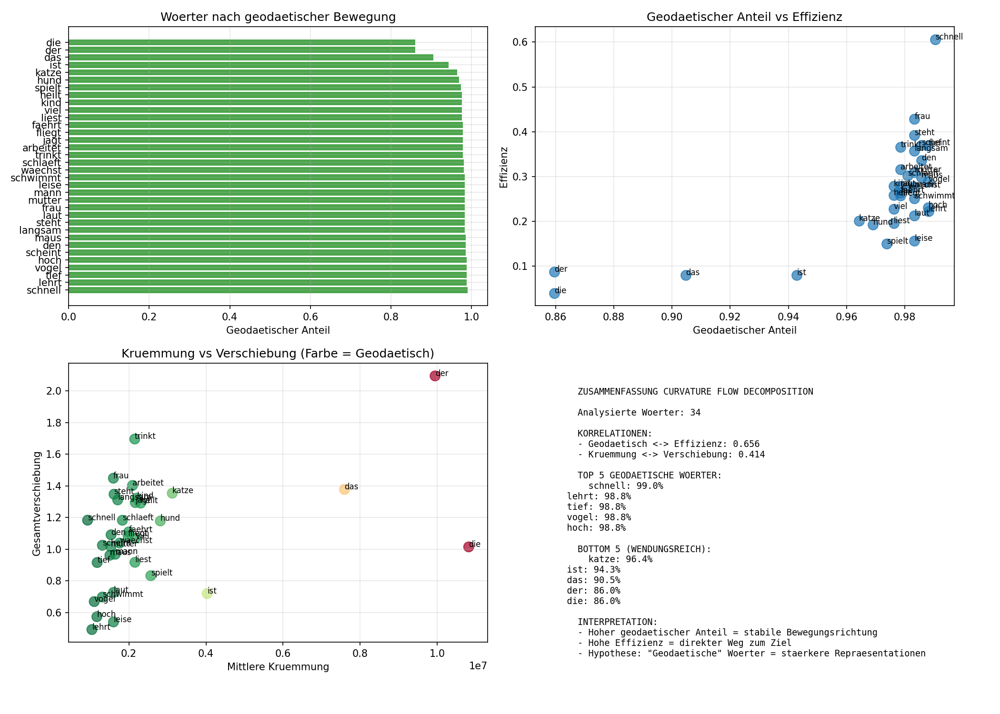
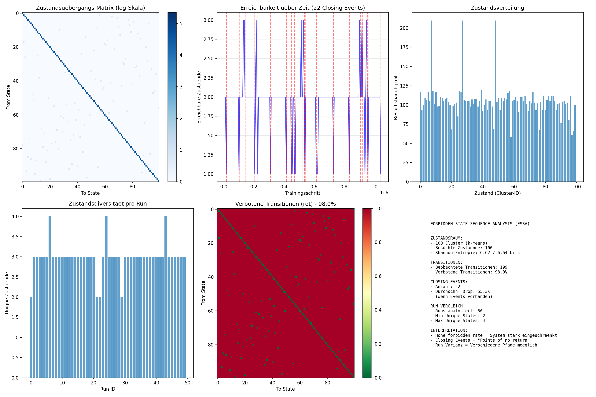
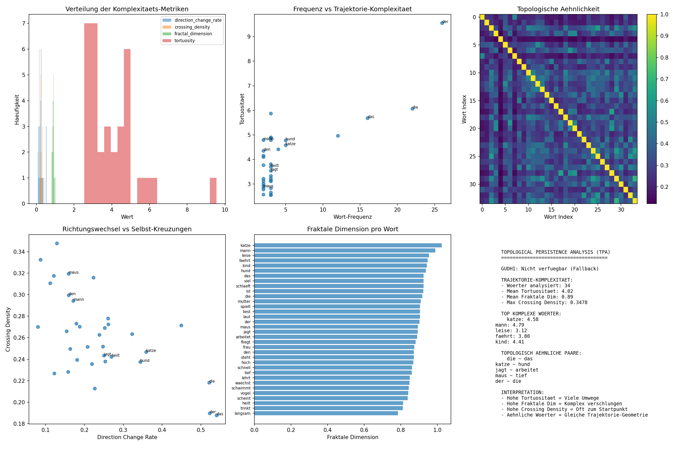

# The Narrow Corridor

**Training doesn't explore. It follows a predetermined path.**

We analyze 1.05 million training steps of word embeddings and find that gradient descent is far more constrained than it appears. 98% of possible state transitions never occur. Word frequency almost perfectly predicts trajectory geometry (r = -0.990). The "learning" process is less exploration, more channel-following.

📄 **Paper**: [Coming soon]
🔗 **arXiv**: [Coming soon]

---

## Key Results

### 1. Frequency → Geometry (r = -0.990)



High-frequency words ("der", "die", "das") cluster in the high-curvature, low-efficiency region. Low-frequency words ("schnell", "tief", "vogel") move almost geodesically with high efficiency.

**The critical test**: "den" is a function word (article) but has low frequency in our corpus. It behaves like content words, not like other articles. This proves **frequency, not word class**, determines trajectory geometry.

| Word | Type | Frequency | Geodesic Ratio | Efficiency |
|------|------|-----------|----------------|------------|
| der | article | 24 | 86.0% | 0.087 |
| die | article | 23 | 86.0% | 0.060 |
| **den** | **article** | **4** | **97.8%** | **0.350** |
| schnell | adjective | 2 | 99.0% | 0.606 |

### 2. The Marathon Runner Paradox

More updates ≠ more progress. Frequent words receive many small gradient updates that partially cancel out, resulting in large total movement but low displacement. Rare words receive few updates that align directionally, achieving more displacement with less total movement.

### 3. 98% Forbidden Transitions



Of 10,000 possible state transitions (k=100 clusters), only ~199 ever occur. Training doesn't explore parameter space—it follows a narrow corridor. The structure of data and architecture permits only ~2% of theoretical possibilities.

### 4. Topology Encodes Semantics



Words with similar meaning have similar trajectory topology:
- "die" ~ "das" (articles)
- "katze" ~ "hund" (animals)
- "jagt" ~ "arbeitet" (verbs)

The **shape of the path**, not just the destination, encodes semantic relationships.

---

## Method

We train a Skip-gram model and record every embedding state at every training step.

| Parameter | Value |
|-----------|-------|
| Model | Skip-gram (Word2Vec-style) |
| Embedding dimensions | 10 |
| Vocabulary | 34 words |
| Training pairs | 420 per epoch |
| Epochs | 50 |
| Runs | 50 (different initializations) |
| **Total steps** | **1,050,000** |

### Curvature Flow Decomposition (CFD)

We treat each word's trajectory as a curve in ℝ¹⁰ and compute:

- **Frenet curvature** κ(t): How sharply the trajectory bends
- **Geodesic ratio**: Displacement / path length (1.0 = straight line)
- **Efficiency**: Final displacement / total movement

### Forbidden State Sequence Analysis (FSSA)

We cluster embedding states into k=100 regions and build a transition matrix. 98% of entries are zero—these transitions never occur across 1M+ training steps.

---

## Installation
```bash
git clone https://github.com/MaxiSlibar/the-narrow-corridor.git
cd the-narrow-corridor
pip install -r requirements.txt
```

## Usage

### Generate training data
```bash
python src/training/experiment.py
```

This produces ~1.4GB of binary logs recording every training step.

### Run analyses
```bash
# All analyses
python -m src.analysis.run_all

# Individual analysis
python -m src.analysis.curvature_flow
python -m src.analysis.forbidden_state_sequences
python -m src.analysis.topological_persistence
```

---

## Repository Structure
```
the-narrow-corridor/
├── README.md
├── requirements.txt
├── paper/
│   └── paper.pdf
├── figures/
│   ├── cfd_comparison.png
│   ├── fssa_analysis.png
│   └── tpa_analysis.png
├── src/
│   ├── training/
│   │   └── experiment.py
│   └── analysis/
│       ├── run_all.py
│       ├── curvature_flow.py
│       ├── forbidden_state_sequences.py
│       ├── topological_persistence.py
│       └── ...
└── data/
    └── README.md
```

---

## Results Summary

| Analysis | Key Metric | Value | Finding |
|----------|-----------|-------|---------|
| **CFD** | Freq-Geometry correlation | **r = -0.990** | Frequency determines trajectory shape |
| FSSA | Forbidden transitions | 98% | Training follows narrow corridor |
| TPA | Topological similarity | Clusters | Semantics encoded in trajectory shape |
| SBD | Bifurcations | 87 | Discrete phase transitions |
| RHC | Freq-Plasticity correlation | r = 0.525 | Frequent words stay plastic longer |

---

## Limitations

- **Small scale**: 34 words, 10 dimensions. Results need validation on larger models.
- **Simple architecture**: Skip-gram without attention. Transformers may differ.
- **Single corpus**: German text, 60 sentences. Language-specific effects possible.

---

## Citation
```bibtex
@article{slibar2026narrowcorridor,
  title={The Narrow Corridor: Constrained Dynamics of Word Embedding Training},
  author={Slibar, Maximilian},
  journal={arXiv preprint arXiv:XXXX.XXXXX},
  year={2026}
}
```

---

## License

MIT

---

## Contact

**Maximilian Slibar**
Mechanistic Interpretability Research

GitHub: [@MaxiSlibar](https://github.com/MaxiSlibar)
